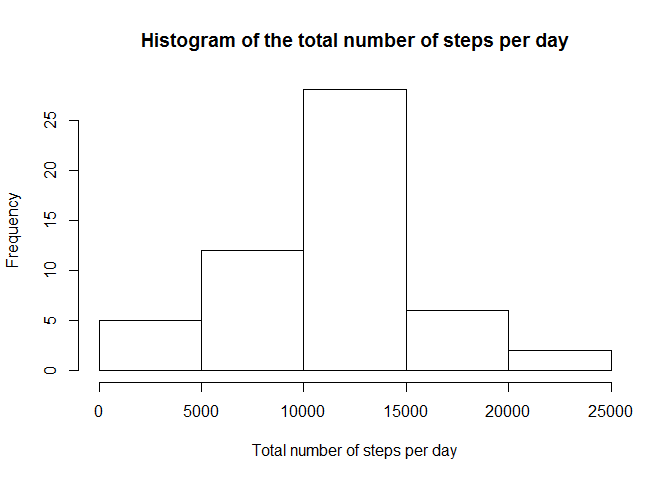

# Reproducible Research: Peer Assessment 1


## Loading and preprocessing the data

```r
# read the data
activity=read.csv("../RepData_PeerAssessment1/activity.csv")
```


## What is mean total number of steps taken per day?

```r
# plot the histogram
totalStepsPerDay=aggregate(activity$steps,by=list(activity$date),sum)
hist(totalStepsPerDay[,2], xlab= "Total number of steps per day", main = "Histogram of the total number of steps per day")
```

 

```r
# calculate the mean value
mean(totalStepsPerDay[,2],na.rm=TRUE)
```

```
## [1] 10766.19
```

```r
# calculate the median value
median(totalStepsPerDay[,2],na.rm=TRUE)
```

```
## [1] 10765
```


## What is the average daily activity pattern?

```r
# calculate the mean for the 5-minute interval and plot vs time series
timeSeries=aggregate(activity$steps, by=list(activity$interval), mean, na.rm=TRUE)
plot(timeSeries[,1],timeSeries[,2], xlab="interval", ylab="average steps across days", main="daily activity pattern")
```

 

```r
Max=max(timeSeries[,2])
for (i in 1:length(timeSeries[,1]))
 {
  if (timeSeries[i,2] == Max)
   { print(timeSeries[i,1]) }
  }
```

```
## [1] 835
```


## Imputing missing values

```r
# number of missing values
sum(is.na(activity$steps))
```

```
## [1] 2304
```

```r
# replace the missing vlues with the mean for the 5-minute interval
activity[is.na(activity$steps),"steps"]=timeSeries[,2]
newActivity=activity;
totalStepsPerDay=aggregate(newActivity$steps,by=list(newActivity$date),sum)
hist(totalStepsPerDay[,2],xlab= "Total number of steps per day", main = "Histogram of the total number of steps per day")
```

 

```r
mean(totalStepsPerDay[,2],na.rm=TRUE)
```

```
## [1] 10766.19
```

```r
median(totalStepsPerDay[,2],na.rm=TRUE)
```

```
## [1] 10766.19
```
The mean of the dataset is still the same while the median increased a little after replacing the missing values. Since we are adding mean value to the dataset, it should decrease the standard deviation of the dataset.


## Are there differences in activity patterns between weekdays and weekends?

```r
# specify a day as weekday or weekend
weekDays<-weekdays(as.Date(newActivity$date,"%Y-%m-%d"))
weekend=c("Saturday","Sunday")
Days=NULL

for (day in weekDays)
{
  if (sum(day==weekend)==1)
    Days<-c(Days,"weekend")
  else
    Days<-c(Days,"weekday")
}

# bind the factor with the dataset
newActivity<-cbind(newActivity, Days=Days)

timeSeriesOnDays=aggregate(newActivity$steps,by=list(newActivity$interval, newActivity$Days), mean)

names(timeSeriesOnDays)=c("interval","Days","steps")

library(lattice)
with(timeSeriesOnDays,xyplot(steps~interval | Days, type="l", layout=c(1,2), ylab="Number of steps" ))
```

 
